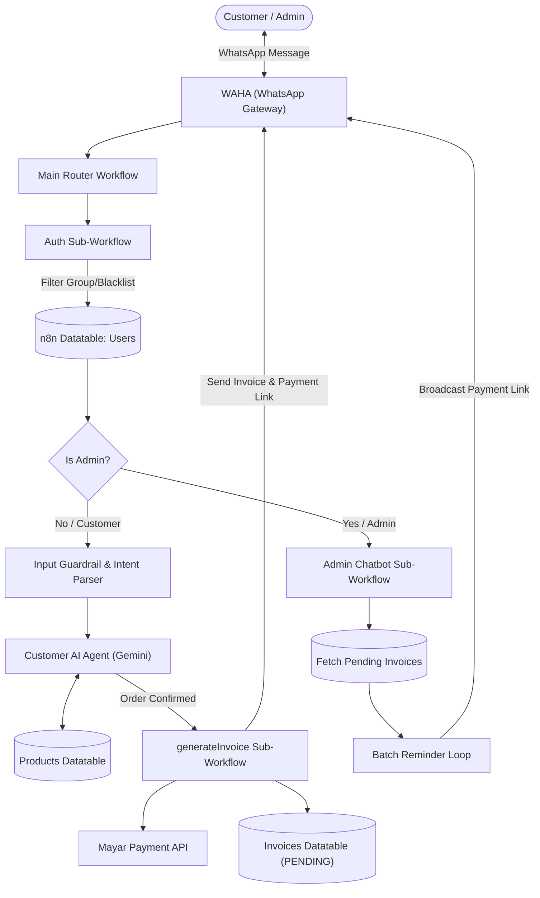
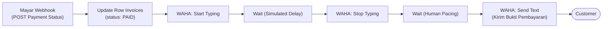

# WhatsApp AI CRM & Automated Invoicing Agent

An enterprise-grade, conversational WhatsApp CRM and autonomous sales agent designed for F&B/Retail businesses. Built with **n8n**, **Google Gemini LLM**, **WAHA (WhatsApp HTTP API)**, and **Mayar Payment Gateway**, this system automates end-to-end customer interactions—from dynamic product consultation and guardrailed order processing to instant invoice generation, payment webhook reconciliation, and automated admin broadcast reminders.

---

## Key Features

* **Smart Ingestion & Role-Based Access Control (RBAC):**
  * Automated user authentication against internal Data Tables.
  * Group message filtering (`@g.us`), blacklist protection, and self-message exclusion.
  * Context-aware routing that segments incoming chats into **Customer Chatbot** vs. **Admin Assistant**.

* **Autonomous Sales Agent with Safety Guardrails:**
  * Powered by Google Gemini with conversational memory buffer window.
  * Strict guardrail layer to validate user purchase intent and prevent hallucinated pricing/discounts.
  * Connected to real-time `Products` Datatable to answer detailed menu queries, portion info, and availability.
  * Direct execution of purchase intent without redundant questionnaires (zero-friction order confirmation).

* **Automated Invoicing & Mayar Gateway Integration:**
  * Real-time calculation and item normalization via deterministic JavaScript Code nodes.
  * Programmatic invoice creation via Mayar API with unique invoice identifiers (`INV-YYYYMMDD`).
  * Auto-generates shareable payment links with 24-hour expiration lifecycles.

* **Real-Time Payment Webhook & Reconciliation:**
  * Listens for payment confirmation webhooks from Mayar.
  * Automatically updates database invoice status from `PENDING` to `PAID`.
  * Triggers natural WhatsApp receipt confirmation to the customer with human-like typing simulation.

* **Admin CRM Broadcast & Invoice Debt Reminders:**
  * LLM-driven admin intent classifier (`REMINDER`, `HELP`, `GREETINGS`, `OTHER`).
  * Scans all `PENDING` transactions and executes automated batch reminder loops to pending customers.

* **Human-Like UX Experience:**
  * Simulated presence with dynamic message read receipts (`Send Seen`), typing states (`Start/Stop Typing`), and randomized wait intervals.

---

## Tech Stack & Services

* **Workflow Orchestration:** [n8n] (Modular Multi-Workflow Architecture)
* **LLM & Reasoning Engine:** Google Gemini (LangChain Nodes)
* **WhatsApp Gateway:** [WAHA] (WhatsApp HTTP API - Core WebJS)
* **Payment Processor:** [Mayar] (API & Webhook integration)
* **Database & Memory:** n8n Internal Data Tables (`users`, `Products`, `Invoices`) & Memory Buffer Window

---
## System Architecture

### 1. Ingestion, Authentication & Agent Pipeline

### 2. Payment Reconciliation Webhook Pipeline
